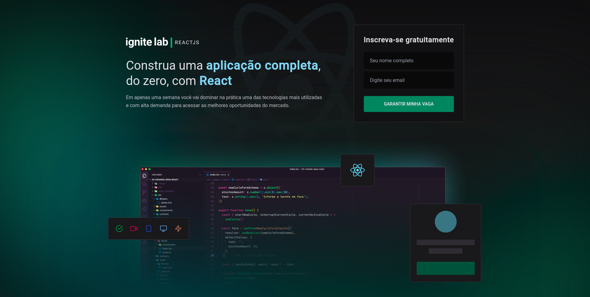
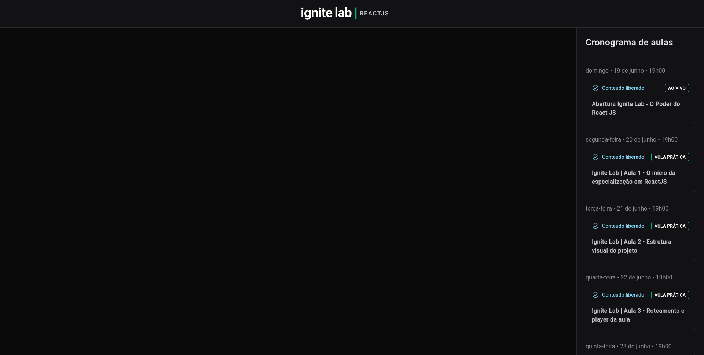
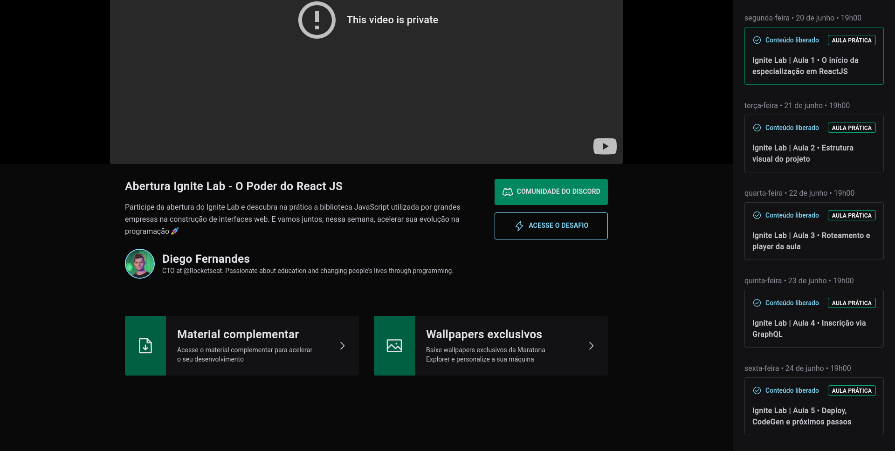

  
  <h1>Plataforma de Vídeos</h1>
  <h3>
    Plataforma para eventos em vídeo em
    <a href="https://reactjs.org">React</a> :rocket:
  </h3>

  

    <strong>Índice</strong>
  

  <ol>
    <li>
      <a href="#preview-do-app">Preview do App</a>
      <ul>
        <li>
          <a href="#página-de-login">Página de Login</a>
        </li>
        <li>
          <a href="#página-de-hub-de-vídeos">Página de Hub de Vídeos</a>
        </li>
        <li>
          <a href="#vídeo">Vídeo</a>
        </li>
      </ul>
    </li>
  </ol>

## Preview do App

#### Página de Login

[<a href="#top">Voltar ao topo</a>]

#### Página de Hub de Vídeos

[<a href="#top">Voltar ao topo</a>]

#### Vídeo

[<a href="#top">Voltar ao topo</a>]

